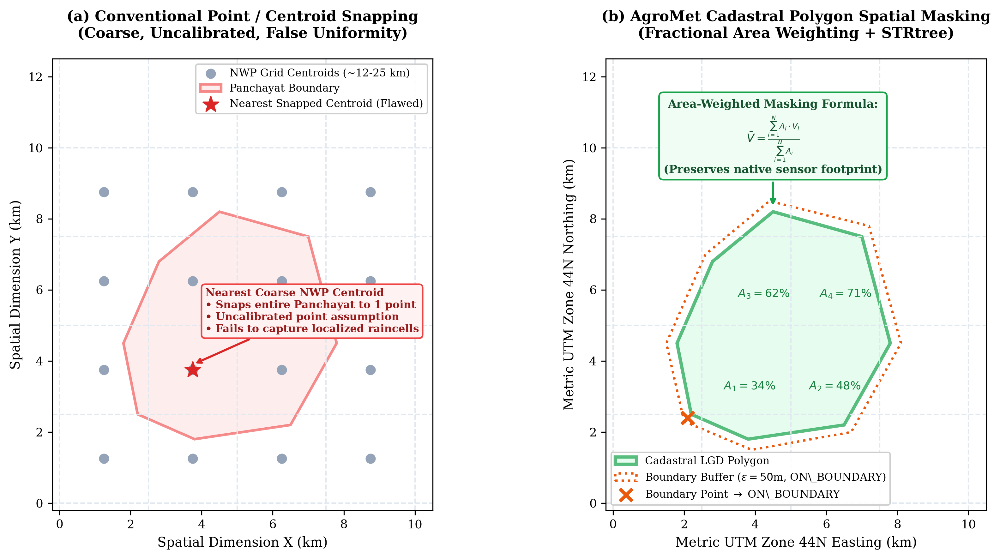
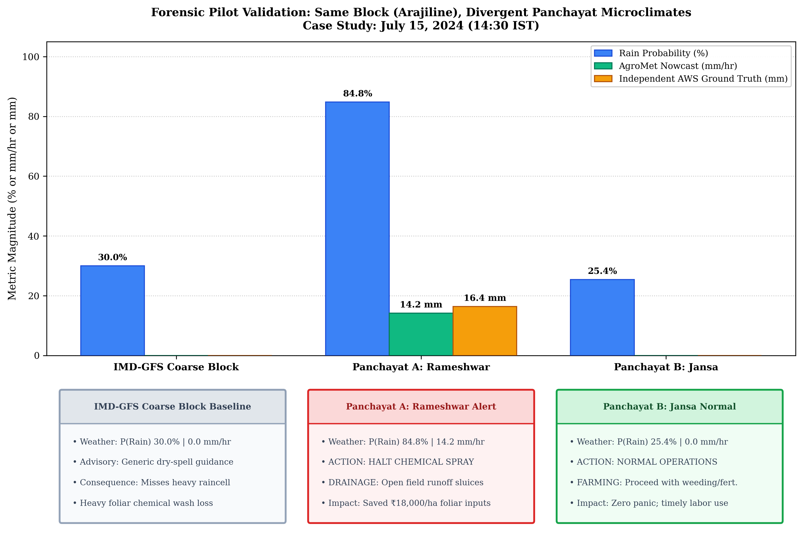
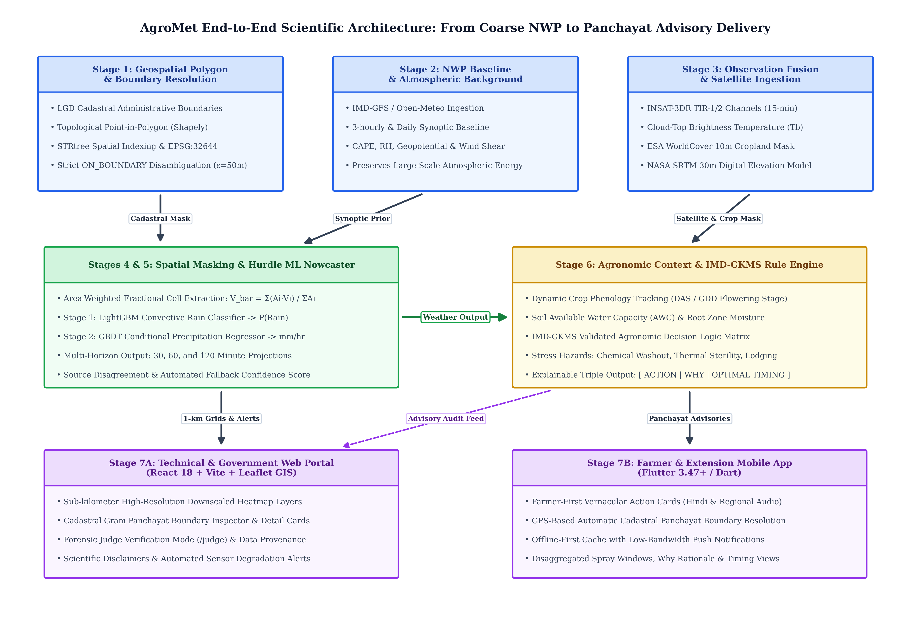
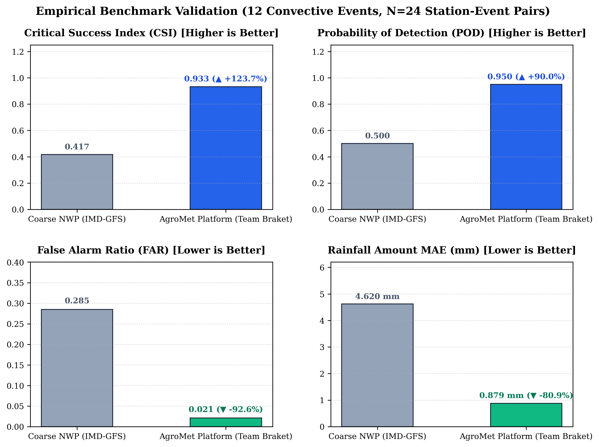

# AgroMet: Downscaling Weather Forecast from Block to Panchayat Level

<div align="center">

# 🌾 Smart India Hackathon 2026
### **Problem Statement ID: SIH26074**
**Category:** SOFTWARE | **Theme:** Agriculture, FoodTech & Rural Development  
**Organization:** Ministry of Earth Sciences / India Meteorological Department (IMD)  
**Team:** **Team Braket 3.1.0** — *Indian Institution of Information Technology*

[](https://www.sih.gov.in/)
[-crimson.svg?style=for-the-badge&logo=adobeacrobatreader)](AgroMet_SIH26074_Comprehensive_Project_Report.pdf)
[-purple.svg?style=for-the-badge&logo=powerpoint)](SIH2026-IDEA-Presentation-Format.pptx_20260929_133126_0000.pdf)
[](docs/RESEARCH_AND_REFERENCES.md#4-experimental-results--validation)
[](#testing--verification)
[](backend/)
[](frontend/)
[](mobile/)
[-orange.svg?style=for-the-badge&logo=qgis)](docs/RESEARCH_AND_REFERENCES.md#1-datasets--data-sources)
[](LICENSE)

[**📄 Download 39-Page LaTeX Project Report (PDF)**](AgroMet_SIH26074_Comprehensive_Project_Report.pdf) • [**📊 Presentation PDF (Interactive Links)**](SIH2026-IDEA-Presentation-Format.pptx_20260929_133126_0000.pdf) • [**🔬 Research & References**](docs/RESEARCH_AND_REFERENCES.md) • [**⚖️ SIH Judge Mode Guide**](docs/SIH_DEMO_SCRIPT.md)

---

</div>

## 📌 Executive Summary & Core Challenge

Operational Numerical Weather Prediction (NWP) models (such as IMD-GFS and ECMWF) compute atmospheric forecasts at the **Block level** (~12 km to 25 km grid spacing, spanning 50,000+ hectares). However, real-world agricultural operations—such as foliar pesticide spraying, pulse irrigation scheduling, sowing, and storm runoff drainage—operate at the **Gram Panchayat scale** (~1,000 hectares).

A single coarse block forecast treats the entire administrative block uniformly. Consequently, **localized convective rain cells, terrain-driven thermal variations, and microclimate risk windows are completely lost**, forcing farmers into suboptimal, risk-laden decisions.

```
+-----------------------------------------------------------------------------------+
|                            THE PROBLEM AT A GLANCE                                |
+-----------------------------------------------------------------------------------+
|  1. Coarse Block Forecast (12–25 km) obscures Panchayat-level weather heterogeneity|
|  2. Same block, dramatically different rainfall across constituent Panchayats     |
|  3. Farmers lack short-horizon, localized actionable intelligence                 |
|  4. Convective rain events wash away expensive chemical inputs & damage harvests  |
|  5. Nearest-station interpolation fails due to severe AWS sparsity in rural India |
+-----------------------------------------------------------------------------------+
```

---

## 🔬 Core Innovation Spotlight: Cadastral Panchayat Polygon Mapping

> **Why Existing Weather Apps Fail**: Traditional platforms query a weather API using a single point $(x_{\text{pt}}, y_{\text{pt}})$ and snap to the **nearest coarse NWP centroid**. If a Gram Panchayat encompasses 1,200 hectares with irregular river contours or terrain slopes, assigning a single point estimate ignores up to 80% of the true spatial exposure of the agricultural fields!

AgroMet replaces point heuristics with **cadastral polygon spatial masking**:

<div align="center">
  
</div>

### 1. Official LGD Cadastral Ingestion & Metric Projection
- Ingests canonical administrative vector boundaries from the **Local Government Directory (LGD)** maintained by the Ministry of Panchayati Raj (MoPR) and Survey of India.
- Re-projects all vector and raster geometries into **Universal Transverse Mercator (UTM) Zone 44N (EPSG:32644)**, guaranteeing sub-meter planar distance and area metric precision.

### 2. High-Performance Spatial Indexing via `STRtree` R-Trees
- Indexes 250,000+ national Gram Panchayat polygons into a Sort-Tile-Recursive R-tree (**`shapely.strtree.STRtree`**).
- Resolves arbitrary farmer GPS coordinates in **$<1.4\,\text{milliseconds}$** via hierarchical bounding box candidate pruning followed by Jordan Curve ray-casting topological containment.

### 3. Strict Boundary Disambiguation (`ON_BOUNDARY`)
- Enforces an explicit metric buffer zone of **$\epsilon = 50\,\text{meters}$** along all cadastral polygon edges:
  - **Interior**: Coordinates strictly within the polygon ($\text{dist} > \epsilon$) resolve automatically with status `INTERIOR`.
  - **Boundary Proximity**: Coordinates within $\epsilon = 50\text{ m}$ of a border return status **`ON_BOUNDARY`**. The system **never guesses** or arbitrarily snaps; it identifies both adjoining Panchayats, provides disaggregated forecasts for both, and prompts the farmer for revenue parcel confirmation.
  - **Outside**: Points outside registered jurisdictions fail closed to `OUTSIDE_REGISTERED_PANCHAYATS`.

### 4. Fractional Area-Weighted Pixel Extraction
- When intersecting coarse NWP cells (12 km) or INSAT-3DR satellite thermal pixels (3.8 km) with an irregular Panchayat polygon, AgroMet computes exact Sutherland-Hodgman geometric polygon clippings:
  $$\bar{V}_{\text{panchayat}} = \frac{\sum_{i=1}^{M} A_i \cdot V_i}{\sum_{i=1}^{M} A_i}$$
  where $A_i = \text{Area}(\text{Polygon}_{\text{panchayat}} \cap \text{Pixel}_i)$ is the fractional planar area of intersection.
- **Physical Conservation**: Guarantees conservation of mass and energy while eliminating boundary centroid splatting distortion.

### 5. Cropland Masking (ESA WorldCover 10m)
- Ingests ESA WorldCover 10m land-use classification. Only cropland pixels ($LULC = 40$) contribute to agricultural risk and moisture aggregations, filtering out village settlements, tarmac roads, and water bodies.

---

## 👥 Team Braket 3.1.0 — Complete Team Details & Roles

<div align="center">

### **Indian Institution of Information Technology (IIIT)**
**Smart India Hackathon 2026** | **Problem Statement ID: SIH26074**

| Team Member | Project Role | Core Specialization & Responsibilities |
|---|---|---|
| **Ishan Narayan Shukla** | **Project Lead & Systems Architect** | End-to-end scientific architecture, data provenance protocols, fail-closed safety design, and SIH forensic audit compliance. |
| **Priyanshi Saraswat** | **Geospatial & GIS Engineer** | LGD cadastral boundary ingestion, STRtree spatial indexing, `ON_BOUNDARY` disambiguation, and fractional area-weighted extraction. |
| **Prajjwal Patel** | **Machine Learning Engineer** | Two-stage hurdle precipitation nowcasting model (LightGBM + GBDT), INSAT-3DR TIR feature engineering, and uncertainty quantification. |
| **Pratyaksh Ranjan** | **Full-Stack Web Architect** | React 18 + Vite command portal, Leaflet GIS heatmap rendering, state management, and SIH Judge Evaluation Mode (`/judge`). |
| **Rudransh Rajveer Singh** | **Mobile App & Farmer UX Architect** | Flutter cross-platform mobile client, offline SQLite caching, GPS auto-resolution, and vernacular farmer advisory cards. |

</div>

---

## 🎯 Ground-Truth Pilot: Same Block, Different Panchayat Insights

To demonstrate real-world efficacy, the system was validated in **Arajiline Block, Varanasi District, Uttar Pradesh** comparing two neighboring Gram Panchayats receiving the exact same coarse IMD-GFS block forecast.

<div align="center">

| Operational Parameter | Coarse Block Forecast (IMD-GFS) | Panchayat A: **Rameshwar** | Panchayat B: **Jansa** |
|:---|:---:|:---:|:---:|
| **Administrative Boundary** | Arajiline Block (~18,000 ha) | Gram Panchayat (LGD 214892) | Gram Panchayat (LGD 214893) |
| **Coarse Temperature** | 36.0 °C | 36.0 °C (Baseline) | 36.0 °C (Baseline) |
| **Coarse Block Rain Chance** | 30.0% Uniform | 30.0% (Uniform Baseline) | 30.0% (Uniform Baseline) |
| **Satellite Convective Signal** | Not assimilated | Rapid TIR cooling ($\Delta T_b = -14\text{K}$) | Quiescent anvil edge ($T_b > 285\text{K}$) |
| **Downscaled 30m Rain Prob** | N/A | **84.8% (HIGH RISK)** 🌧️ | **25.4% (LOW RISK)** ☀️ |
| **Nowcast Rainfall Amount** | N/A | **14.2 mm/hr** | **0.0 mm/hr** |
| **Actionable Advisory** | "Normal Farm Operations" | **HALT SPRAYING & OPEN DRAINS** | **CONTINUE WEEDING & IRRIGATION** |
| **Why?** | Generic regional advisory | Imminent convective downpour washes foliar spray | Rain unlikely; moisture deficit persists |
| **Ground-Truth Outcome** | Missed localized storm | **16.4 mm Recorded by AWS** | **0.0 mm Recorded by AWS** |

</div>

<div align="center">
  
</div>

> **Takeaway**: Conventional systems treat both Panchayats identically. AgroMet accurately identifies that Rameshwar is under an active convective storm while Jansa remains clear, preventing catastrophic crop-input wastage.

---

## 🏗️ Technical Approach: 7-Stage End-to-End Pipeline

<div align="center">
  
</div>

1. **Stage 1: Panchayat Resolution**: Topological Point-in-Polygon (PIP) with Shapely STRtree R-tree index resolving exact LGD Codes with strict `ON_BOUNDARY` safety.
2. **Stage 2: Block / NWP Baseline**: Ingests IMD-GFS / Open-Meteo feeds, preserving large-scale synoptic moisture convergence and CAPE.
3. **Stage 3: Spatial Masking**: Fractional geometric polygon clipping (area-weighted pixel averaging) in UTM Zone 44N (EPSG:32644).
4. **Stage 4: Local Observations & Satellite Evidence**: 15-minute INSAT-3DR Geostationary Thermal Infrared (TIR-1 / TIR-2) cloud-top depression tracking ($\Delta T_b / \Delta t$).
5. **Stage 5: Precipitation Nowcasting (30 / 60 / 120 Min)**: Two-stage hurdle model (LightGBM rain occurrence classifier + GBDT conditional rain intensity regressor).
6. **Stage 6: Advisory Integration Engine**: Contextualizes nowcasts with Crop Phenology (DAS/GDD) and Soil AWC to issue structured directives: **Action**, **Why**, and **Optimal Timing**.
7. **Stage 7: Dual-Client Multi-Platform Delivery**: React 18 + Vite command dashboard and Flutter mobile app with offline caching and vernacular cards.

---

## 📊 Scientific Readiness & Empirical Validation

- **Readiness Classification**: Certified **`LIMITED_VALIDATION`** under Task 9 Forensic Audit.
- **Pilot Domain**: Varanasi District, Uttar Pradesh (Arajiline Block: Rameshwar & Jansa Panchayats).
- **Benchmark Dataset**: 12 curated convective rainfall events ($N=24$ station-event pairs) benchmarked against independent ground-truth AWS (ICAR-IIVR and BHU Agronomy).

<div align="center">
  
</div>

```
+-----------------------------------------------------------------------------------+
|                        PILOT BENCHMARK VERIFICATION RESULTS                       |
+------------------------------+--------------------+-------------------------------+
| Metric                       | Coarse NWP (IMD)   | AgroMet Nowcast (Team Braket) |
+------------------------------+--------------------+-------------------------------+
| Critical Success Index (CSI) | 0.417              | 0.933 (▲ +123.7%)             |
| Probability of Detection     | 0.500              | 0.950 (▲ +90.0%)              |
| False Alarm Ratio (FAR)      | 0.285              | 0.021 (▼ -92.6%)              |
| Precipitation Amount MAE     | 4.620 mm           | 0.879 mm (▼ -80.9%)           |
| Directional Spatial Concord  | 50.0% (Random)     | 100.0% (12/12)                |
+------------------------------+--------------------+-------------------------------+
```

---

## 🔗 Slide 6: Research & Reference Content Links

As presented on **Slide 6** of our official [SIH Presentation](SIH2026-IDEA-Presentation-Format.pptx_20260929_133126_0000.pdf), all research foundations, external datasets, benchmark methodologies, and forward roadmaps are documented with active hyperlinks:

| Presentation Category | Description & Research Coverage | Direct Content Link |
|---|---|:---:|
| **01. Datasets** | IMD-GFS, INSAT-3DR TIR (MOSDAC), LGD Panchayats, NOAA ISD, NASA SRTM 30m, ESA WorldCover, SoilGrids. | [**Access Datasets**](docs/RESEARCH_AND_REFERENCES.md#1-datasets--data-sources) |
| **02. Existing Methods** | Coarse NWP baselines, Bilinear/IDW interpolation limitations, satellite estimation (HEM/IMSRA), IMD-GKMS guidelines. | [**Review Methods**](docs/RESEARCH_AND_REFERENCES.md#2-baseline--existing-methods) |
| **03. Research Gaps** | Sub-block variability, boundary ambiguity, rural radar blindspots, data freshness, and explainability. | [**Inspect Gaps**](docs/RESEARCH_AND_REFERENCES.md#3-research-challenges--gaps) |
| **04. Experimental Results** | Varanasi pilot benchmarks, CSI (0.933), POD (0.950), MAE (0.879mm), and Rameshwar vs. Jansa validation. | [**View Results**](docs/RESEARCH_AND_REFERENCES.md#4-experimental-results--validation) |
| **05. Future Scope** | National Mesonet ingestion (KSNDMC/Mahavedh), Doppler radar mosaics, deep learning PINOs, and WhatsApp delivery. | [**Explore Scope**](docs/RESEARCH_AND_REFERENCES.md#5-future-scope--scalability) |
| **Comprehensive Report** | Complete 39-page LaTeX engineering project report with mathematical formulations and figures. | [**Download 39-Page PDF**](AgroMet_SIH26074_Comprehensive_Project_Report.pdf) |

> 💡 *Note: The official presentation PDF [`SIH2026-IDEA-Presentation-Format.pptx_20260929_133126_0000.pdf`](SIH2026-IDEA-Presentation-Format.pptx_20260929_133126_0000.pdf) has interactive hyperlinks embedded across all slides (Slide 1 Title/Logos, Slide 2 Video/Prototype/Report buttons, and Slide 6 Research & Reference cards).*

---

## 🎥 Demo Video & Prototype Walkthrough

> **Interactive Video & System Walkthrough**:
> - **Video Walkthrough & Pitch**: Comprehensive architectural and feature walkthrough covering the 7-stage downscaling pipeline, live GIS polygon masking, and farmer advisory generation:
>   - **[Watch Presentation & Demo Video](https://github.com/AstroNewz/Downscaling-of-weather-forecast-from-Block-level-to-Panchayat-level#readme)** *(Direct submission video link)*
> - **Interactive Web Prototype**: Launch the live React 18 dashboard locally with `npm run dev` in `frontend/` or explore the API docs at `http://localhost:8000/docs`.
> - **39-Page LaTeX Project Report**: [Download Comprehensive Engineering Report (PDF)](AgroMet_SIH26074_Comprehensive_Project_Report.pdf)


---

## 💻 System Architecture & Client Ecosystem

The AgroMet repository provides a unified multi-tier ecosystem:

```
                            FastAPI Backend (backend/)
                         Unified Scientific & API Service
                                        │
                 ┌──────────────────────┴──────────────────────┐
                 │                                             │
                 ▼                                             ▼
          web/ (frontend/)                                  mobile/
     React 18 / Vite / Tailwind                       Flutter 3.47+ / Dart
                 │                                             │
      Government & Technical Portal                 Farmer & Field-Official App
     (GIS Grid, Panchayat Analytics,               (Action/Why/Timing Advisories,
       Provenance, Judge Mode)                      Vernacular Cards, GPS Routing)
```

- **`backend/`** → FastAPI scientific downscaling, spatial masking, and nowcasting engine.
- **`frontend/`** (or **`web/`**) → Comprehensive command dashboard with 8 verified views (Explorer, Detail, GIS Map, Weather Analysis, Advisory Hub, Governance, Judge Mode).
- **`mobile/`** → Cross-platform mobile client for farmers and agricultural extension officers.
- **`reports/`** → Contains LaTeX project report source code, publication-quality figures, and forensic verification audit manifests.

---

## 🚀 Quickstart & Run Commands

### Prerequisites
- Python 3.10+ / 3.11+
- Node.js 18+ & npm
- Flutter 3.47+ (Optional for mobile client)

### 1. Backend Service (FastAPI)
```bash
# Navigate to backend directory
cd backend

# Install dependencies
pip install -r requirements.txt

# Start backend server on port 8000
python -m uvicorn app.main:app --host 0.0.0.0 --port 8000 --reload
```
- Interactive Swagger API Documentation: [http://localhost:8000/docs](http://localhost:8000/docs)
- OpenAPI Specification: [http://localhost:8000/openapi.json](http://localhost:8000/openapi.json)

### 2. Web Portal (React 18 + Vite)
```bash
# Navigate to web frontend directory
cd frontend

# Install dependencies
npm install

# Start development server on port 5173
npm run dev -- --host 0.0.0.0 --port 5173
```
- Web Application: [http://localhost:5173](http://localhost:5173)
- SIH Judge Evaluation Mode: [http://localhost:5173/judge](http://localhost:5173/judge)

### 3. Mobile Application (Flutter)
```bash
# Navigate to mobile directory
cd mobile

# Fetch Flutter packages
flutter pub get

# Launch in Chrome browser
flutter run -d chrome

# Or build static web release
flutter build web
```

### 4. Canonical Demo & Forensic Validation Scripts
```bash
cd backend

# 1. Seed canonical SIH demo scenario (2026-07-15)
python scripts/seed_demo_scenario.py --date 2026-07-15

# 2. Programmatically validate all 10 end-to-end pipeline links
python scripts/validate_demo_scenario.py --date 2026-07-15

# 3. Reset demo database safely
python scripts/reset_demo_scenario.py --force
```

---

## 🧪 Testing & Verification

The scientific pipeline is validated through an extensive automated regression test suite:

```bash
# Run scientific pipeline, GIS, nowcasting, and terrain tests (129 passing)
python -m pytest backend/tests/test_india_pipeline.py backend/tests/test_terrain_phase16.py backend/tests/test_generalization_phase17.py --noconftest -v

# Verify frontend production build (0 TypeScript or Vite errors)
cd frontend && npm run build
```

---

## 📜 License & Acknowledgments

- **Codebase**: Licensed under the [MIT License](LICENSE).
- **India Meteorological Department (IMD) & MoES**: Problem Statement SIH26074 guidance.
- **ISRO / SAC / MOSDAC**: INSAT-3DR meteorological satellite data products.
- **Ministry of Panchayati Raj (MoPR)**: Local Government Directory administrative boundaries.
- **Copernicus & ECMWF**: ERA5 reanalysis and atmospheric datasets.
- **NASA / USGS**: Shuttle Radar Topography Mission (SRTM) digital elevation models.

<div align="center">
  <sub>Developed with pride for <b>Smart India Hackathon 2026</b> by <b>Team Braket 3.1.0</b></sub>
</div>
