# Panchayat-Level Precipitation Nowcast Advisory Integration
**Problem Statement SIH 26074:** Downscaling of Weather Forecast from Block Level to Panchayat Level for Agro-Meteorological Advisory Services  
**Document Identifier:** `TASK5-ADVISORY-INTEGRATION-V1`  
**Status:** Approved & Certified  
**Date:** September 2026  

---

## 1. Executive Summary & Scientific Motivation

In Indian agriculture, operational field decisions—specifically chemical/biological spraying and surface irrigation—are highly time-sensitive. Synoptic-scale Numerical Weather Prediction (NWP) models (such as IMD-GFS at ~12–25 km grid spacing) provide macroscale multi-day precipitation outlooks. However, isolated convective cloud cells frequently initiate, rain out, and dissipate within small spatial footprints ($< 10\text{ km}$) and short temporal windows (30–120 minutes).

Under standard Block-level advisories:
- An entire Block might receive advice to "Irrigate wheat" based on synoptic conditions, even as a localized convective thunderstorm moves over an individual Gram Panchayat.
- Conversely, a Block-level rain alert might induce farmers in a completely dry adjacent Panchayat to postpone urgent pesticide spraying, causing pest outbreaks.

**Task 5 Objective:** Integrate the localized observation-fused precipitation nowcasts (developed in Task 4) directly into the operational agricultural advisory engine without breaking, replacing, or silently altering existing validated baseline advisory rules.

---

## 2. Core Governance Principles & Invariants

| Principle | Governance Guardrail |
| :--- | :--- |
| **No Overwriting of Baseline Rules** | Phase 10 / Phase 11 Advisory Engine remains the definitive source of truth for seasonal/daily agricultural risk. Nowcast acts solely as a short-horizon operational modifier. |
| **No Verified Accuracy Claims** | Localized nowcasting provides conservative, risk-hedging indicators; it does **not** claim certified millimeter-level rainfall ground-truth. |
| **Explicit Advisory-Use States** | Every nowcast evaluation is strictly classified into one of 5 discrete states. `INSUFFICIENT_DATA` or `LOW_CONFIDENCE` is **never** treated as "no rain". |
| **Conservative Disagreement Phrasing** | When macroscale NWP and satellite/radar evidence contradict, confidence is capped at `LOW` and conflicting signals are explicitly exposed. |
| **Auditability Contract** | Both `baseline_precipitation_context` and `localized_nowcast_context` are preserved side-by-side in every `AdvisoryResult`. |
| **Presentation Contract** | Every advisory strictly delivers three key elements: **Action** (`action_text`), **Why** (`rationale`), and **Timing** (`timing`). |

---

## 3. Advisory-Use Operational State Machine

```mermaid
stateDiagram-v2
    [*] --> Evaluation
    Evaluation --> NOWCAST_NOT_AVAILABLE : nowcast is None
    Evaluation --> NOWCAST_INSUFFICIENT_DATA : coverage < 20% OR data stale OR missing
    Evaluation --> NOWCAST_LOW_CONFIDENCE : single stream OR high latency OR disagreement
    Evaluation --> NOWCAST_MEDIUM_CONFIDENCE : NWP + satellite consistent OR partial radar
    Evaluation --> NOWCAST_HIGH_CONFIDENCE : multi-stream concordance (NWP + fresh satellite +/- radar)

    NOWCAST_NOT_AVAILABLE --> BaselinePreserved : 100% baseline guidance unchanged
    NOWCAST_INSUFFICIENT_DATA --> BaselinePreserved : Baseline unchanged; no fake clear window
    NOWCAST_LOW_CONFIDENCE --> ContextOnly : Informational mention; no aggressive shifts
    NOWCAST_MEDIUM_CONFIDENCE --> CautiousRefinement : Cautious operational alerts
    NOWCAST_HIGH_CONFIDENCE --> ActionableRefinement : Immediate spray deferral or irrigation hold
```

---

## 4. Conservative Agronomic Policy Table

| Agronomic Operation | Nowcast Horizon & Signal | Confidence Tier | Recommended Advisory Action (`Action`) | Scientific Agronomic Rationale (`Why`) | Urgency & Timing |
| :--- | :--- | :--- | :--- | :--- | :--- |
| **Foliar Spraying & Pesticide Application** | Imminent Rain: $P(\text{rain}) \ge 0.50$ in 30–60 min | `HIGH` | Postpone chemical spraying and foliar fertilizer application. | Rain within 1–2 hours washes active chemical ingredients into runoff, causing economic loss and groundwater contamination. | `IMMEDIATE` Next 30–60 min |
| **Foliar Spraying & Pesticide Application** | Imminent Rain: $P(\text{rain}) \ge 0.50$ in 30–60 min | `MEDIUM` | Hold planned foliar spraying temporarily; observe local cloud development. | Moderate likelihood of rain clouds developing; spraying carries substantial wash-off risk. | `UPCOMING` Next 60 min |
| **Foliar Spraying & Pesticide Application** | Clear Sky Window: $P(\text{rain}) < 0.20$ across next 120 min | `HIGH` / `MEDIUM` | Favorable short-horizon window for necessary spraying (ensure wind $< 15\text{ km/h}$). | Satellite observations confirm clear conditions over Panchayat with low short-term convection risk. | `ROUTINE` Next 1–2 hours |
| **Surface & Sprinkler Irrigation** | Imminent Substantial Rain: $P(\text{rain}) \ge 0.50$, expected $\ge 5\text{ mm}$ in 60–120 min | `HIGH` / `MEDIUM` | Withhold planned surface and sprinkler irrigation; allow natural precipitation to satisfy soil moisture. | Irrigating immediately ahead of rainfall induces root-zone hypoxia, promotes fungal root rot, causes crop lodging, and wastes irrigation energy. | `IMMEDIATE` Next 1–2 hours |
| **Surface & Sprinkler Irrigation** | Dry Window: $P(\text{rain}) < 0.20$ in next 120 min | `HIGH` / `MEDIUM` | Proceed with planned scheduled micro-irrigation as per soil moisture deficit. | No imminent rain predicted to alleviate root zone moisture tension. | `ROUTINE` Scheduled window |
| **Field Operations / Disagreement** | Signal Divergence: NWP predicts rain, but satellite detects dry/clear sky | `LOW` (Capped) | Exercise caution: synoptic forecast indicates rain today, but satellite shows clear skies over Panchayat in next 60m. Keep field drains open but avoid premature emergency action. | Satellite observations show delay or divergence from macroscale NWP. Confidence is capped at LOW to avoid false alarms. | `ROUTINE` Next 60–120 min |

---

## 5. Adjacent Panchayat Differentiation (A/B Separation)

- **Block NWP Baseline:** Dholakpur Block baseline predicts $6.0\text{ mm}$ widespread light-to-moderate rain across the Block ($P = 0.55$).
- **Panchayat A (Dholakpur West):** Convective cell detected directly overhead ($P(\text{rain}) = 0.95$, expected $= 16.5\text{ mm}$, `HIGH` confidence).
  - *Action:* **Postpone chemical spraying immediately.**
- **Panchayat B (Dholakpur East):** Clear skies outside cloud shield ($P(\text{rain}) = 0.10$, expected $= 0.0\text{ mm}$, `HIGH` confidence).
  - *Action:* **Favorable window for planned foliar spraying.**

Both preserve the identical Block NWP baseline while delivering agronomically distinct, local actions.
