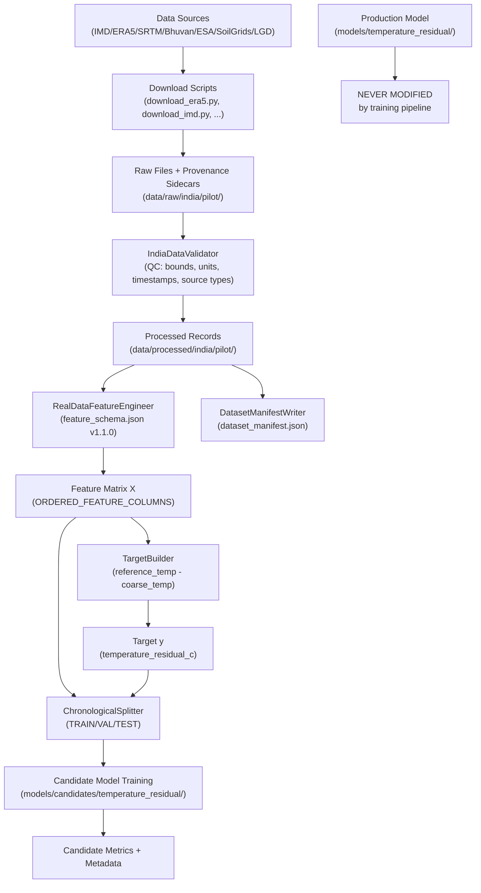

# Real India Data Pipeline — Technical Documentation

**Project**: Agroweather-Downscaling — SIH Problem Statement 26074  
**Pilot**: Varanasi District, Uttar Pradesh, India  
**Last updated**: 2026-09-17  

---

## Table of Contents

1. [Architecture Overview](#architecture-overview)
2. [Varanasi Pilot Definition](#varanasi-pilot-definition)
3. [Data Source Taxonomy](#data-source-taxonomy)
4. [Data Acquisition](#data-acquisition)
5. [Raw / Intermediate / Processed Structure](#raw--intermediate--processed-structure)
6. [Validation and QC](#validation-and-qc)
7. [Spatial Processing](#spatial-processing)
8. [Feature Engineering](#feature-engineering)
9. [Target Construction](#target-construction)
10. [Train / Validation / Test Splitting](#train--validation--test-splitting)
11. [Leakage Prevention](#leakage-prevention)
12. [Candidate Model Training](#candidate-model-training)
13. [Provenance and Manifests](#provenance-and-manifests)
14. [Real vs Demo Data Separation](#real-vs-demo-data-separation)
15. [Failure Behavior](#failure-behavior)
16. [CRS Policy](#crs-policy)
17. [Scalability to All India](#scalability-to-all-india)

---

## Architecture Overview



---

## Varanasi Pilot Definition

| Property | Value |
|---|---|
| Country | India |
| State | Uttar Pradesh |
| District | Varanasi |
| AOI Latitude | 25.10° – 25.60° N |
| AOI Longitude | 82.70° – 83.20° E |
| Geographic CRS | EPSG:4326 (WGS84) |
| Metric CRS | EPSG:32644 (WGS 84 / UTM Zone 44N, dynamically computed) |
| Grid Resolution | 1 km × 1 km |
| Pilot Period | 2024-06-01 to 2024-08-31 (Kharif season) |

### Pilot Blocks

- Varanasi Sadar
- Pindra
- Arajiline
- Cholapur
- Kashi Vidyapeeth
- Badagaon
- Sevapuri
- Harahua
- Chiraigaon

### Known AWS Stations (Status: SOURCE_ACCESS_REQUIRED)

| Station ID | Name | Latitude | Longitude | Organization |
|---|---|---|---|---|
| AWS_BHU_001 | BHU Automatic Weather Station | 25.2677°N | 82.9913°E | BHU / IMD |
| AWS_BABATPUR_002 | Babatpur Airport AWS | 25.4520°N | 82.8590°E | IMD / AAI |

> **Note**: These stations are configured in `india_pilot.yaml` with `data_status: SOURCE_ACCESS_REQUIRED`. They have **not** been confirmed as downloaded. See [INDIA_PILOT_DATASET.md](./INDIA_PILOT_DATASET.md) for actual acquisition status.

### Chronological Splits

| Split | Start | End | Duration |
|---|---|---|---|
| TRAIN | 2024-06-01 | 2024-07-15 | 45 days |
| VALIDATION | 2024-07-16 | 2024-07-31 | 16 days |
| TEST | 2024-08-01 | 2024-08-31 | 31 days |

Splits are **strictly non-overlapping** — `ChronologicalSplitter` raises `ValueError` if any temporal overlap is detected.

---

## Data Source Taxonomy

The pipeline uses five source types. These are mutually exclusive and must not be misapplied.

| Type | Definition | Examples |
|---|---|---|
| `OBSERVATION` | Direct physical measurements from real instruments | IMD AWS stations, rain gauges |
| `REANALYSIS` | Model-assimilated historical reconstruction — NOT station data | ERA5, ERA5-Land |
| `NWP_FORECAST` | Numerical weather prediction output | IMD-GFS, NCMRWF UMO |
| `REMOTE_SENSING` | Satellite/airborne derived measurements | SRTM DEM, ESA WorldCover, Bhuvan LULC |
| `DERIVED` | Post-processed combinations of other sources | SoilGrids, LGD Boundaries, lapse rate correction |
| `ADMINISTRATIVE` | Geographic / governance boundaries | LGD boundaries |

> **Critical**: ERA5 and ERA5-Land are **REANALYSIS** products. Classifying them as `OBSERVATION` raises a `ValueError` in `DatasetManifestWriter.build_source_record()` and in the India data validator. This is enforced by code — not just convention.

---

## Data Acquisition

### Download Scripts

| Script | Source | Type | Status |
|---|---|---|---|
| `download_era5.py` | ERA5 / CDS API | REANALYSIS | SOURCE_ACCESS_REQUIRED (CDS account) |
| `download_era5_land.py` | ERA5-Land / CDS API | REANALYSIS | SOURCE_ACCESS_REQUIRED (CDS account) |
| `download_imd.py` | IMD AWS / FTP | OBSERVATION | SOURCE_ACCESS_REQUIRED (IMD agreement) |
| `download_dem.py` | SRTM / NASA Earthdata | REMOTE_SENSING | SOURCE_ACCESS_REQUIRED (Earthdata account) |
| `download_lulc.py` | ESA WorldCover / Bhuvan | REMOTE_SENSING | SOURCE_ACCESS_REQUIRED (Bhuvan account) |
| `download_soil.py` | SoilGrids REST API | DERIVED | SOURCE_ACCESS_REQUIRED (open but rate-limited) |
| `download_india_boundaries.py` | LGD / Bhuvan | ADMINISTRATIVE | SOURCE_ACCESS_REQUIRED |

### Acquisition Status Distinction

```
CODE EXISTS  ≠  DATA ACTUALLY ACQUIRED  ≠  DATA VALIDATED
```

The pipeline records actual acquisition status via `utils/acquisition_status.py`:
- `SUCCESS` — data downloaded and verified
- `SOURCE_ACCESS_REQUIRED` — credentials or manual registration needed
- `PARTIAL` — some temporal/spatial coverage obtained
- `NETWORK_ERROR` — transient connectivity failure

No script substitutes synthetic data when acquisition fails. It writes a status record and exits.

---

## Raw / Intermediate / Processed Structure

```
backend/data/
├── raw/
│   └── india/
│       └── pilot/
│           ├── era5/               # NetCDF files from CDS API
│           ├── era5_land/          # NetCDF files from CDS API
│           ├── imd/                # IMD station CSV/JSON files
│           ├── dem/                # SRTM GeoTIFF tiles
│           ├── lulc/               # LULC rasters
│           ├── soil/               # SoilGrids REST JSON
│           └── boundaries/         # LGD / Bhuvan shapefiles
├── intermediate/
│   └── india/
│       └── pilot/
│           ├── validated/          # QC-flagged records (VALID/SUSPECT/INVALID)
│           └── aligned/            # Temporally and spatially matched records
└── processed/
    └── india/
        └── pilot/
            ├── features/           # Feature matrices (.parquet)
            ├── targets/            # Target vectors (.parquet)
            └── manifests/          # dataset_manifest.json
```

Every raw file written by a download script is accompanied by a `.provenance.json` sidecar (written by `utils/checksum.py:write_retrieval_sidecar()`).

---

## Validation and QC

The `validation/india_data_validator.py` module implements `IndiaDataValidator`:

| Check | Tool | Action on failure |
|---|---|---|
| India geographic bounds (6–38°N, 68–98°E) | `validate_india_bounds()` | Flag INVALID |
| Pilot AOI bbox (25.1–25.6°N, 82.7–83.2°E) | `validate_pilot_aoi()` | Flag WARNING (not rejected) |
| Temperature plausibility (−10 to +52°C for India) | `validate_temperature()` | Flag SUSPECT |
| Temperature physical limits (−60 to +65°C) | `validate_temperature()` | Flag INVALID |
| Precipitation ≥ 0 mm | `validate_precipitation()` | Flag INVALID |
| Humidity 0–100% | `validate_humidity()` | Flag INVALID |
| Wind speed ≥ 0 m/s, ≤ 80 m/s | `validate_wind()` | Flag INVALID |
| UTC timestamp consistency with IST (+05:30) | `validate_timestamp()` | Flag INVALID |
| Source type classification (ERA5 ≠ OBSERVATION) | `validate_source_type_integrity()` | Flag INVALID |
| Source ID uniqueness | `validate_record()` | Flag INVALID |

Quality flags: `VALID` → `SUSPECT` → `MISSING` → `INVALID`  
INVALID records are **never** used for training. SUSPECT records are excluded by default (`EXCLUDE_SUSPICIOUS_BY_DEFAULT=True` in config).

---

## Spatial Processing

### Dynamic UTM CRS

All metric calculations (grid generation, distance, area) use a **dynamically computed local UTM CRS**:

```python
# app/gis/grid.py — SpatialGridGenerator.get_optimal_utm_epsg()
zone = int((lon + 180.0) / 6.0) + 1
epsg = 32600 + zone  # Northern hemisphere
# For Varanasi (lon≈82.97): zone=44, EPSG=32644
```

> **Policy**: EPSG:3857 (Web Mercator) is **never** used for distance, area, or grid calculations. It is present in `core/config.py` (`PROJECTED_SRID=3857`) only as a display/tile server reference, explicitly documented as such.

### 1-km Grid Generation

`app/gis/grid.py:SpatialGridGenerator.generate_grid_for_polygon()`:
1. Parse block polygon in EPSG:4326
2. Compute optimal UTM EPSG from block centroid
3. Project polygon to UTM metric CRS
4. Generate 1000 m × 1000 m grid cells over bounding box
5. Apply boundary rule (`center_inside_block`)
6. Reproject cell centers and polygons back to EPSG:4326

### Panchayat Aggregation

Block-level grid cell predictions are aggregated to panchayat boundaries using LGD administrative polygons. Spatial join uses PostGIS or GeoPandas depending on context.

---

## Feature Engineering

**Module**: `data_pipeline/pipeline/feature_engineer.py`  
**Schema**: `data_pipeline/schemas/feature_schema.json` (version `v1.1.0`)

### Feature Groups

| Group | Features | Source |
|---|---|---|
| Coarse NWP | `forecast_temp_min/max/mean`, `forecast_rainfall_mm`, `forecast_humidity_pct`, `forecast_wind_speed_mps`, `forecast_wind_direction_deg`, `forecast_cloud_cover_pct`, `forecast_lead_hours`, `time_diff_minutes` | ERA5 / NWP |
| Temporal cyclical | `hour_of_day`, `sin_hour`, `cos_hour`, `day_of_year`, `sin/cos_day_of_year`, `month`, `sin/cos_month` | Derived from timestamp |
| Spatial / topographic | `obs_latitude`, `obs_longitude`, `distance_to_centroid_km`, `obs_elevation_m`, `block_elevation_m`, `elevation_diff_m`, `slope_deg`, `aspect_deg`, `sin/cos_aspect`, `terrain_roughness`, `lapse_rate_temp_adjustment_c` | SRTM DEM, derived |
| LULC fractions | `cropland_fraction`, `forest_fraction`, `urban_fraction`, `water_fraction`, `barren_fraction` | Bhuvan / ESA WorldCover |

### Engineering Rules

- **Never fabricate missing meteorological values** — `None` / `NaN` is always preferred
- No new features may be added without updating `feature_schema.json`
- DEMO_DATA and SYNTHETIC_DATA records are rejected (`build_feature_row()` returns `None`)
- ERA5 precipitation conversion: `m × 1000 = mm`
- ERA5 cloud cover conversion: fraction `[0,1] × 100 = %`
- Wind direction: `atan2(u10, v10)` in degrees `[0, 360]`
- Lapse rate adjustment: `elevation_diff_m × (−0.0065 °C/m)`

---

## Target Construction

**Module**: `data_pipeline/pipeline/target_builder.py`

### Formulation (FIXED — do not change)

```
target_temperature_residual_c = reference_temperature_c − coarse_temperature_c
```

Where:
- `reference_temperature_c` = independent reference (IMD AWS station, preferred; or ERA5-Land if AWS unavailable)
- `coarse_temperature_c` = coarse reanalysis/NWP input (ERA5, ~31 km)

### Leakage Prevention Rules

1. `reference_source_id` **must differ** from `coarse_source_id`
2. ERA5 **cannot** simultaneously be the coarse input and the reference (raises `ValueError`)
3. If `reference_temp_c` is `None` → return `None` (never manufacture target)
4. If `coarse_temp_c` is `None` → return `None`
5. All three columns (`reference_temperature_c`, `coarse_temperature_c`, `target_temperature_residual_c`) are stored for auditability

### Validation Types

| Reference Source | Validation Type | Label Required |
|---|---|---|
| IMD AWS (OBSERVATION) | **Station-observed validation** | ✓ Preferred |
| ERA5-Land (REANALYSIS) | **REANALYSIS-to-REANALYSIS** | Must be labelled — NOT station validation |

---

## Train / Validation / Test Splitting

**Module**: `data_pipeline/pipeline/chronological_splitter.py`

```
TRAIN:      2024-06-01 → 2024-07-15  (45 days — early Kharif)
VALIDATION: 2024-07-16 → 2024-07-31  (16 days — mid Kharif, tuning)
TEST:       2024-08-01 → 2024-08-31  (31 days — late Kharif, held-out)
```

`ChronologicalSplitter.__init__()` validates non-overlap at construction time.  
`split_dataframe()` returns `temporal_leakage_safe: bool` in its report.

Optional spatial holdout: one panchayat can be excluded from the training set to test spatial generalization.

---

## Leakage Prevention

| Leakage Type | Where enforced |
|---|---|
| Target column in feature matrix X | `QUARANTINED_COLUMNS` in `feature_engineer.py`; `validate_feature_matrix()` |
| Reference temp = coarse temp source | `TargetBuilder.build_target()` raises `ValueError` |
| Future data in training | `ChronologicalSplitter._validate_no_overlap()` |
| Demo/synthetic in real pipeline | `build_feature_row()` rejects `DEMO_DATA`/`SYNTHETIC_DATA` |
| ERA5 classified as observation | `_validate_source_type()` raises `ValueError` |

---

## Candidate Model Training

**Script**: `backend/train_real_model.py`

```bash
cd backend/
python train_real_model.py \
    --dataset data/processed/india/pilot/features/training.parquet \
    --candidate-version v1.0.0-real-varanasi-pilot
```

### Safety Guarantees

- Production model directory `models/temperature_residual/` is **fingerprinted** before and after training
- All output goes to `models/candidates/temperature_residual/<candidate_version>/`
- If real reference data is unavailable: exits with code `2` and message `REAL_REFERENCE_DATA_REQUIRED`
- If DEMO/SYNTHETIC records detected: rejected before any training
- XGBoost model binary: `model.json`
- Candidate metadata: `metadata.json`
- Metrics: `metrics.json` (MAE, RMSE, R², bias, sample_count per split)
- Feature schema reference: `feature_schema_reference.json`

### Metrics Reported

- MAE, RMSE, R², Bias (overall per split)
- Stratified by month, season (Kharif/Rabi/Zaid)
- Reference source type is explicitly labelled (OBSERVATION vs REANALYSIS)

---

## Provenance and Manifests

### Sidecar Files

Every raw downloaded file gets a `.provenance.json` sidecar via `utils/checksum.py:write_retrieval_sidecar()`:
```json
{
  "source_name": "ERA5",
  "source_type": "REANALYSIS",
  "sha256_checksum": "...",
  "retrieval_timestamp_utc": "...",
  "download_url": "...",
  ...
}
```

### Dataset Manifest

`manifests/dataset_manifest_writer.py:DatasetManifestWriter` produces `dataset_manifest.json` with:
- Geographic identity (country → state → district → block → panchayats)
- All data sources with type, access status, URLs, license, version
- Temporal and spatial extents
- Row counts per split
- QC summary
- File checksums (SHA-256)
- `data_classification`: always `REAL_DATA` for this pipeline (enforced by code)
- `processing_version` and `schema_version`

---

## Real vs Demo Data Separation

The project maintains strict separation between real pipeline data and demo/SIH evaluation fixtures.

| Classification | Usage |
|---|---|
| `REAL_DATA` | Only source permitted in the real training pipeline |
| `DEMO_DATA` | SIH evaluation demo only — cannot enter training pipeline |
| `SYNTHETIC_DATA` | Unit test fixtures only — cannot enter training pipeline |

Enforcement points:
1. `RealDataFeatureEngineer.build_feature_row()` — rejects non-REAL_DATA
2. `DatasetManifestWriter.__init__()` — rejects non-REAL_DATA classification
3. `train_real_model.py:_reject_demo_synthetic_records()` — raises error or exits 2
4. `settings.ML_ALLOW_SYNTHETIC_TRAINING = False` — production policy

---

## Failure Behavior

The pipeline **fails clearly** rather than silently substituting synthetic data:

| Situation | Failure Mode |
|---|---|
| IMD data not downloaded | `SOURCE_ACCESS_REQUIRED` status written; pipeline halts |
| ERA5 CDS credentials missing | `SOURCE_ACCESS_REQUIRED` status; `download_era5.py` exits non-zero |
| Reference temperature entirely null | `REAL_REFERENCE_DATA_REQUIRED` — train script exits code 2 |
| All records are DEMO/SYNTHETIC | `ValueError` with clear message; exits code 2 |
| Target leakage detected | `ValueError` with specific columns listed; exits code 1 |
| Production model modified | `RuntimeError` post-training safety check |

---

## CRS Policy

| Context | CRS | Notes |
|---|---|---|
| Geographic coordinates (lat/lon) | **EPSG:4326** | All feature columns, stored coordinates |
| Metric grid generation, distance, area | **Dynamic UTM** (EPSG:32644 for Varanasi) | Computed by `SpatialGridGenerator.get_optimal_utm_epsg()` |
| Map tile display / web frontend | EPSG:3857 (Web Mercator) | Display only — never used for scientific calculations |

> `PROJECTED_SRID = 3857` in `core/config.py` has a code comment explicitly labelling it as "DISPLAY/TILE CRS ONLY". It is not referenced in any scientific calculation path.

---

## Scalability to All India

The pipeline is designed to scale from the Varanasi pilot to all-India operation with only configuration changes:

1. **Configuration**: New region config in `data_pipeline/config/india_regions.yaml` (all regions currently `active: false`)
2. **AOI**: Replace Varanasi bbox with state/district boundaries
3. **Downloads**: Same download scripts, different bbox clip parameters
4. **UTM CRS**: Automatically computed per region — no code change needed
5. **Splits**: New date ranges via config
6. **Grid**: Same 1-km generator, larger polygon

**No code changes** are required to scale — only YAML configuration.

---

*This document describes the pipeline as implemented. Actual data acquisition status is documented in [INDIA_PILOT_DATASET.md](./INDIA_PILOT_DATASET.md).*
