# Panchayat-Level Precipitation Nowcast Advisory Integration
**Problem Statement SIH 26074:** Downscaling of Weather Forecast from Block Level to Panchayat Level for Agro-Meteorological Advisory Services  
**Document Identifier:** `TASK5-ADVISORY-INTEGRATION-V1`  
**Status:** Approved & Certified  
**Date:** September 2026  

---

## 1. Executive Summary & Scientific Motivation

In Indian agriculture, operational field decisions—specifically chemical/biological spraying and surface irrigation—are highly time-sensitive. Synoptic-scale Numerical Weather Prediction (NWP) models (such as IMD-GFS at ~12–25 km grid spacing) provide macroscale multi-day precipitation outlooks. However, isolated convective cloud cells frequently initiate, rain out, and dissipate within small spatial footprints ($< 10\text{ km}$) and short temporal windows (30–120 minutes).

Under standard Block-level advisories:
- An entire Block might receive advice to "Irrigate wheat" based on synoptic conditions, even as a localized convective thunderstorm moves over an individual Gram Panchayat.
- Conversely, a Block-level rain alert might induce farmers in a completely dry adjacent Panchayat to postpone urgent pesticide spraying, causing pest outbreaks.

**Task 5 Objective:** Integrate the localized observation-fused precipitation nowcasts (developed in Task 4) directly into the operational agricultural advisory engine without breaking, replacing, or silently altering existing validated baseline advisory rules.

---

## 2. Core Governance Principles & Invariants

| Principle | Governance Guardrail |
| :--- | :--- |
| **No Overwriting of Baseline Rules** | Phase 10 / Phase 11 Advisory Engine remains the definitive source of truth for seasonal/daily agricultural risk. Nowcast acts solely as a short-horizon operational modifier. |
| **No Verified Accuracy Claims** | Localized nowcasting provides conservative, risk-hedging indicators; it does **not** claim certified millimeter-level rainfall ground-truth. |
| **Explicit Advisory-Use States** | Every nowcast evaluation is strictly classified into one of 5 discrete states. `INSUFFICIENT_DATA` or `LOW_CONFIDENCE` is **never** treated as "no rain". |
| **Conservative Disagreement Phrasing** | When macroscale NWP and satellite/radar evidence contradict, confidence is capped at `LOW` and conflicting signals are explicitly exposed. |
| **Auditability Contract** | Both `baseline_precipitation_context` and `localized_nowcast_context` are preserved side-by-side in every `AdvisoryResult`. |
| **Presentation Contract** | Every advisory strictly delivers three key elements: **Action** (`action_text`), **Why** (`rationale`), and **Timing** (`timing`). |

---

## 3. Advisory-Use Operational State Machine

To prevent reckless automated interventions, nowcast evidence is routed through an explicit state machine:

```mermaid
stateDiagram-v2
    [*] --> Evaluation
    Evaluation --> NOWCAST_NOT_AVAILABLE : nowcast is None
    Evaluation --> NOWCAST_INSUFFICIENT_DATA : coverage < 20% OR data stale OR missing
    Evaluation --> NOWCAST_LOW_CONFIDENCE : single stream OR high latency OR disagreement
    Evaluation --> NOWCAST_MEDIUM_CONFIDENCE : NWP + satellite consistent OR partial radar
    Evaluation --> NOWCAST_HIGH_CONFIDENCE : multi-stream concordance (NWP + fresh satellite +/- radar)

    NOWCAST_NOT_AVAILABLE --> BaselinePreserved : 100% baseline guidance unchanged
    NOWCAST_INSUFFICIENT_DATA --> BaselinePreserved : Baseline unchanged; no fake clear window
    NOWCAST_LOW_CONFIDENCE --> ContextOnly : Informational mention; no aggressive shifts
    NOWCAST_MEDIUM_CONFIDENCE --> CautiousRefinement : Cautious operational alerts
    NOWCAST_HIGH_CONFIDENCE --> ActionableRefinement : Immediate spray deferral or irrigation hold
```



### Definitions:
1. `NOWCAST_NOT_AVAILABLE`: Nowcast feature flag off or not requested. Advisories rely 100% on baseline downscaled weather.
2. `NOWCAST_INSUFFICIENT_DATA`: Observations are stale ($> 45\text{ min}$), coverage is $< 20\%$, or corrupted. **Guardrail:** The engine never treats this as dry weather.
3. `NOWCAST_LOW_CONFIDENCE`: Nowcast derived from a single unverified stream or shows high internal variance. Action strength: `CONTEXT_ONLY`.
4. `NOWCAST_MEDIUM_CONFIDENCE`: Satellite IR/HEM confirms NWP signals with acceptable coverage ($> 60\%$). Action strength: `CAUTIOUS`.
5. `NOWCAST_HIGH_CONFIDENCE`: Fresh multi-platform concordance ($< 20\text{ min}$ latency, full coverage). Action strength: `STRONG`.

---

## 4. Conservative Agronomic Policy Table

The integration layer enforces strict agronomic guidelines curated from ICAR and IMD agrometeorological advisories:

| Agronomic Operation | Nowcast Horizon & Signal | Confidence Tier | Recommended Advisory Action (`Action`) | Scientific Agronomic Rationale (`Why`) | Urgency & Timing |
| :--- | :--- | :--- | :--- | :--- | :--- |
| **Foliar Spraying & Pesticide Application** | Imminent Rain: $P(\text{rain}) \ge 0.50$ in 30–60 min | `HIGH` | Postpone chemical spraying and foliar fertilizer application. | Rain within 1–2 hours washes active chemical ingredients into runoff, causing economic loss and groundwater contamination. | `IMMEDIATE`<br>Next 30–60 min |
| **Foliar Spraying & Pesticide Application** | Imminent Rain: $P(\text{rain}) \ge 0.50$ in 30–60 min | `MEDIUM` | Hold planned foliar spraying temporarily; observe local cloud development. | Moderate likelihood of rain clouds developing; spraying carries substantial wash-off risk. | `UPCOMING`<br>Next 60 min |
| **Foliar Spraying & Pesticide Application** | Clear Sky Window: $P(\text{rain}) < 0.20$ across next 120 min | `HIGH` / `MEDIUM` | Favorable short-horizon window for necessary spraying (ensure wind $< 15\text{ km/h}$). | Satellite observations confirm clear conditions over Panchayat with low short-term convection risk. | `ROUTINE`<br>Next 1–2 hours |
| **Surface & Sprinkler Irrigation** | Imminent Substantial Rain: $P(\text{rain}) \ge 0.50$, expected $\ge 5\text{ mm}$ in 60–120 min | `HIGH` / `MEDIUM` | Withhold planned surface and sprinkler irrigation; allow natural precipitation to satisfy soil moisture. | Irrigating immediately ahead of rainfall induces root-zone hypoxia, promotes fungal root rot, causes crop lodging, and wastes irrigation energy. | `IMMEDIATE`<br>Next 1–2 hours |
| **Surface & Sprinkler Irrigation** | Dry Window: $P(\text{rain}) < 0.20$ in next 120 min | `HIGH` / `MEDIUM` | Proceed with planned scheduled micro-irrigation as per soil moisture deficit. | No imminent rain predicted to alleviate root zone moisture tension. | `ROUTINE`<br>Scheduled window |
| **Field Operations / Disagreement** | Signal Divergence: NWP predicts rain, but satellite detects dry/clear sky | `LOW` (Capped) | Exercise caution: synoptic forecast indicates rain today, but satellite shows clear skies over Panchayat in next 60m. Keep field drains open but avoid premature emergency action. | Satellite observations show delay or divergence from macroscale NWP. Confidence is capped at LOW to avoid false alarms. | `ROUTINE`<br>Next 60–120 min |

---

## 5. Adjacent Panchayat Differentiation (A/B Separation)

A core requirement of Problem Statement SIH 26074 is demonstrating that adjacent Panchayats within the same administrative Block receive distinct, tailored operational guidance when localized atmospheric conditions differ.

### Case Study: Dholakpur Block (Adjacent Panchayats A & B)
- **Macroscale Baseline:** Dholakpur Block receives an IMD-GFS forecast predicting $6.0\text{ mm}$ widespread light-to-moderate rain across the Block ($P = 0.55$).
- **Panchayat A (Dholakpur West):**
  - Georeferenced satellite IR detects an active convective cloud cell directly over Panchayat A ($P(\text{rain}) = 0.95$, expected $= 16.5\text{ mm}$, Confidence: `HIGH`).
  - **Advisory Result for Panchayat A:**
    - **Action:** *"Postpone chemical spraying, bio-pesticides, and foliar fertilizer applications for the next 30–60 minutes. Rain is imminent over the Panchayat."*
    - **Timing:** *"Next 30–60 minutes (Recheck nowcast before spraying)"*
    - **Urgency:** `IMMEDIATE` | **Priority:** `HIGH`
- **Panchayat B (Dholakpur East):**
  - Georeferenced satellite IR detects clear skies outside the convective cell ($P(\text{rain}) = 0.10$, expected $= 0.0\text{ mm}$, Confidence: `HIGH`).
  - **Advisory Result for Panchayat B:**
    - **Action:** *"Favorable window for necessary foliar spraying, nutrient application, or weeding in Wheat. Ensure wind speeds are below 15 km/h before spraying."*
    - **Timing:** *"Next 1–2 hours"*
    - **Urgency:** `ROUTINE` | **Priority:** `LOW`

**Result:** Despite sharing identical Block NWP baselines, Panchayat A and Panchayat B receive opposite, agronomically correct operational advice.

---

## 6. Auditability & Side-by-Side Traceability Schema

Every `AdvisoryResult` serialized by the system contains the full audit trail:

```json
{
  "panchayat_id": 101,
  "panchayat_name": "Dholakpur West",
  "crop_name": "Wheat",
  "advisory_type": "SHORT_HORIZON_OPERATIONS_ADVISORY",
  "priority": "HIGH",
  "title": "Wheat Spraying Window: Imminent Rain Precaution",
  "message": "Precipitation expected within 30 min (P=95%). Delay chemical/foliar spraying.",
  "action": {
    "action_category": "CROP_PROTECTION",
    "action_text": "Postpone chemical spraying, bio-pesticides, and foliar fertilizer applications for the next 30–60 minutes. Rain is imminent over the Panchayat.",
    "timing": "Next 30–60 minutes (Recheck nowcast before spraying)",
    "urgency": "IMMEDIATE"
  },
  "rationale": "High-confidence localized nowcast indicates rain is likely (P=95%) within 30 minutes. Rainfall within 1–2 hours of spraying washes active ingredients off foliage, resulting in financial loss and ground contamination.",
  "nowcast_advisory_state": "NOWCAST_HIGH_CONFIDENCE",
  "baseline_precipitation_context": {
    "source_model": "IMD-GFS",
    "forecast_valid_time": "2026-09-27T06:00:00",
    "baseline_precipitation_mm": 6.0,
    "baseline_probability": 0.55,
    "block_id": 1,
    "block_name": "Dholakpur"
  },
  "localized_nowcast_context": {
    "panchayat_id": "101",
    "valid_time": "2026-09-27T07:00:00",
    "horizon_minutes": 60,
    "rain_probability": 0.95,
    "expected_amount_mm": 16.5,
    "confidence": "HIGH",
    "source_state": "NWP_SATELLITE",
    "evidence_sources": ["NWP", "SATELLITE"],
    "evidence_disagreement": false,
    "observation_age_minutes": 12.0,
    "spatial_coverage": 1.0,
    "method_version": "DETERMINISTIC_RESEARCH_HEURISTIC_V1"
  },
  "nowcast_explanation": {
    "primary_reason": "Wheat Spraying Window: Imminent Rain Precaution",
    "localized_precipitation_signal": "P(rain)=0.95 at 60m (Conf: HIGH)",
    "baseline_signal": "NWP expected=6.0mm",
    "evidence_agreement": true,
    "confidence": "HIGH",
    "action_strength": "STRONG",
    "recommended_horizon_minutes": 60,
    "short_horizon_recommendation": "Postpone chemical spraying for next 30-60 minutes."
  }
}
```

---

## 7. Verification & Regression Matrix

All tests passed successfully in the backend test environment:

```
tests/test_panchayat_boundary_service.py     PASSED (16/16)
tests/test_spatial_masking_service.py        PASSED (20/20)
tests/test_satellite_observation_adapter.py  PASSED (19/19)
tests/test_panchayat_precipitation_nowcast.py PASSED (16/16)
tests/test_panchayat_advisory_nowcast.py     PASSED (12/12)
-------------------------------------------------------------------
TOTAL TASKS 1 THROUGH 5:                     83 PASSED, 0 FAILED
```
